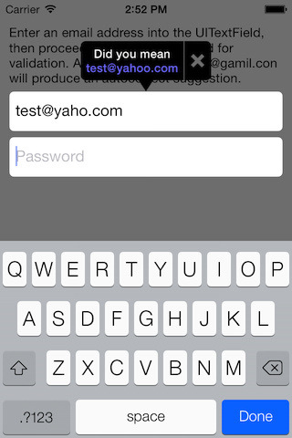

# SpotHeroEmailValidator

An iOS library that will provide basic email syntax validation as well as provide suggestions for possible typos (for example, test@gamil.con would be corrected to test@gmail.com).

## Screenshots

## Usage
### UITextField subclass
The SHEmailValidationTextField class is a pre-built UITextField subclass that will automatically validate its own input when it loses focus (such as when the user goes from the email field to the password field).  If a syntax error is detected, a popup will appear informing the user that the email address they entered is invalid.  If a probably typo is detected, a popup will appear that allows the user to accept the suggestion or dismiss the popup.  Using this class is as simple as replacing instances of UITextField with SHEmailValidationTextField.

#### Customization
To customize the default error message that appear for validation errors, use the `setDefaultErrorMessage:` method.  To set specific messages for specific errors, use the `setMessage:forErrorCode:` method.  To customize the text that appears above a typo suggestion, use the `setMessageForSuggestion:` method.

To customize the look and feel of the popup window that appears, the `fillColor`, `titleColor`, and `suggestionColor` properties can be set as desired.

### Basic syntax checking
	NSError *error = nil;
	[[[SpotHeroEmailValidator] validator] validateSyntaxOfEmailAddress:emailAddress withError:&error];

	if (error) {
		// An error occurred
		switch (error.code) {
			case SHBlankAddressError:
				// Input was empty
				break;
			case SHInvalidSyntaxError:
				// Syntax completely wrong (probably missing @ or .)
				break;
			case SHInvalidUsernameError:
				// Local portion of the email address is empty or contains invalid characters
				break;
			case SHInvalidDomainError:
				// Domain portion of the email address is empty or contains invalid characters
				break;
			case SHInvalidTLDError:
				// TLD portion of the email address is empty, contains invalid characters, or is under 2 characters long
				break;
		}
	} else {
		// Basic email syntax is correct
	}

### Get typo correction suggestion
	NSError *error = nil;
	NSString *suggestion = [[[SpotHeroEmailValidator] validator] autocorrectSuggestionForEmailAddress:emailAddress withError:&error];

	if (error) {
		// The syntax check failed, so no suggestions could be generated
	} else if (suggestion) {
		// A probable typo has been detected and the suggestion variable holds the suggested correction
	} else {
		// No typo was found, or no suggestions could be generated
	}

## Updating the IANA TLD list
To fetch the latest IANA TLDs, run the following script included in the root directory:
  fetch_iana_list.rb

This will update the plist under SpotHeroEmailValidator/DomainData.plist
The script requires the httparty and plist Ruby gems to be installed.

## ARC
SpotHeroEmailValidator uses ARC. If your project is not ARC-compliant, simply set the `-fobjc-arc` flag on all SpotHeroEmailValidator source files.

## Apps Using this Library
This library is used in our own [SpotHero](https://apps.apple.com/us/app/spothero-find-parking-nearby/id499097243) iOS app. If you would like to see your app listed here as well, let us know you're using it!

## License
SpotHeroEmailValidator is released under the Apache 2.0 license.
